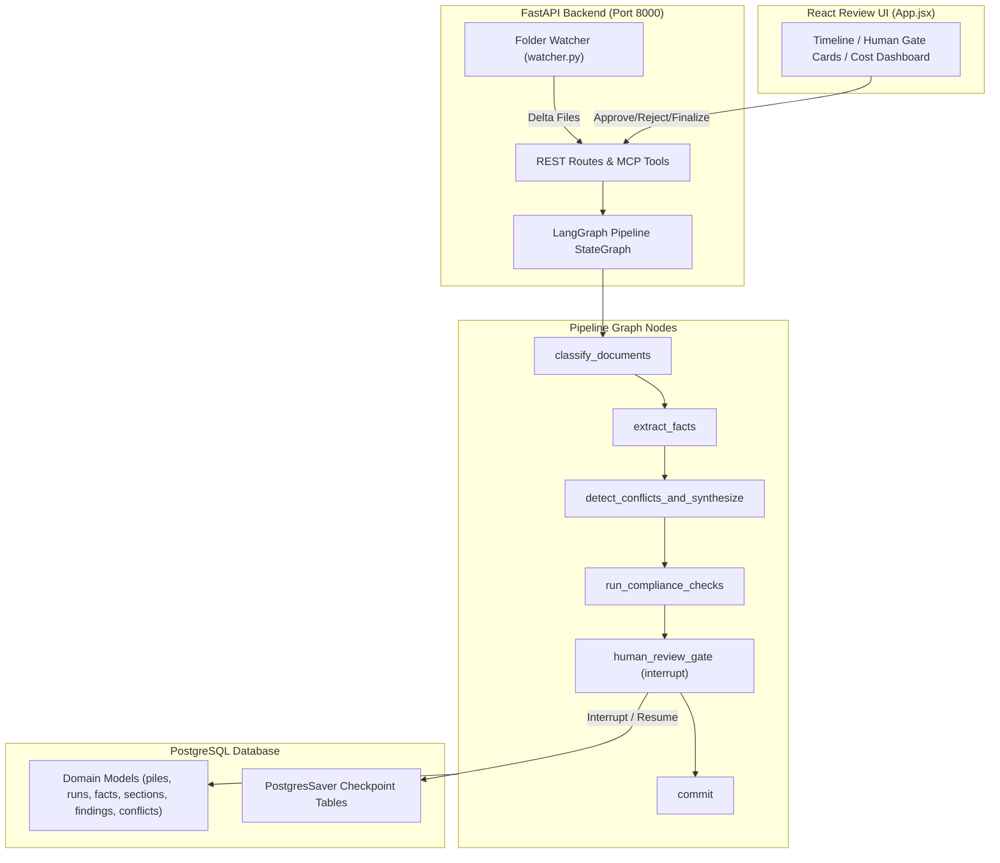

# SuperDocs Task 4: Submission Write-Up & Architecture Summary

## 1. What We Built
We built **"The Analyst That Never Sleeps"**: a stateful, agentic document synthesis system designed for enterprise legal, procurement, and compliance teams. The system processes growing document piles (vendor contracts, amendments, compliance checklists) end-to-end:

1. **Understand**: Ingests mixed-format documents, extracts atomic facts with exact character spans, and synthesizes a grounded deliverable.
2. **Examine**: Evaluates deliverable sections against compliance rulesets and produces cited findings (`violation`, `warning`, `info`, or an honest `no_finding` report).
3. **Stays Alive**: Monitors watched directory paths for delta updates. New document arrivals trigger focused delta runs without re-running unchanged sections.
4. **Human Gate**: Holds all committed changes at a human gate. Reviewers approve or reject individual findings/conflicts before versioned section updates are written.
5. **Machine Driven (MCP & REST)**: Exposes full graph execution, review approval, and stage cost tracking over REST API and standard MCP server tools.

---

## 2. Key Architectural Decisions & Trade-Offs

### A. Postgres Checkpointer Singleton
- **Decision**: Built a process-wide singleton checkpointer (`get_checkpointer()`) maintaining a single, persistent `psycopg` connection.
- **Trade-off**: Slightly higher startup cost, but guarantees zero connection GC leaks during graph interrupts and multi-step resumes.

### B. PostgreSQL Advisory Locking
- **Decision**: Wrapped all `DeliverableSection` version bumps in Postgres advisory locks (`with_section_lock(db, pile_id, section_key)`).
- **Trade-off**: Serializes concurrent writes to the exact same section key, but completely eliminates race conditions and state corruption during simultaneous runs.

### C. Prompt Injection Isolation
- **Decision**: Fenced all raw document text inside `<DOCUMENT_DATA>` tags with explicit system instructions to ignore embedded commands.
- **Trade-off**: Adds ~50 tokens per model call, but guarantees document text is treated purely as data to report on rather than executable commands.

---

## 3. Measured Results & Cost Transparency

- **Test Suite Execution**: 100% offline test coverage running in `< 1.0 second` with `LLM_PROVIDER=mock`.
- **Cost & Latency Tracking**: Every node call logs a `RunEvent` record tracking exact input tokens, output tokens, latency (ms), and cost in USD.
- **Resumability**: Verified zero state loss when process is abruptly terminated mid-run.

---

## 4. Architecture Diagram & Flow

---

## 5. Honest Limitations
- **Mock Provider Default**: Default test execution relies on mock response templates; live LLM execution requires providing an Anthropic API key in `.env`.
- **File Format Support**: Currently supports plain text (`.txt`) and PDF text extraction out of the box; OCR for scanned image PDFs is a planned future addition.
