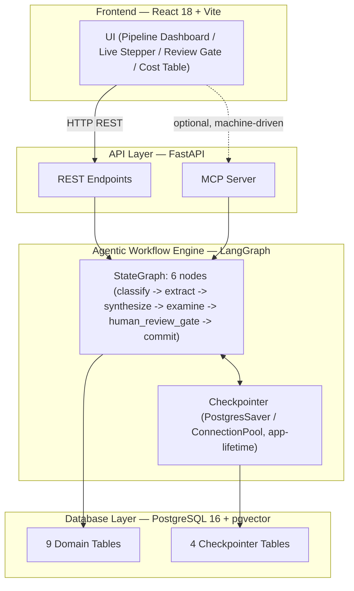

# DocTask — "The Analyst That Never Sleeps"
## Technical Architecture & Implementation Documentation — SuperDocs Engineering Task, Round 2

---

## 1. Executive Summary & Problem Statement

### The Domain Problem
Enterprise documents rarely arrive as a single, self-contained artifact. In legal, procurement, and finance workflows, a vendor relationship typically evolves as a **pile of interrelated documents**: a 50-page Master Services Agreement (MSA) is signed first; six months later, Amendment 1 changes the payment terms from Net 30 to Net 45; a stream of monthly invoices then arrives, each implicitly claiming the amended terms apply; occasionally, a side letter or an internal note contradicts something the formal documents say. No single document in that pile tells the whole story — and the pile keeps growing.

### Why Single-Shot RAG and Chatbots Fail Here
A standard retrieval-augmented generation (RAG) chatbot — chunk documents, embed them, answer questions against top-k matches — breaks down against this problem in three specific, technical ways:

1. **No persistent, versioned artifact**: RAG has no concept of a canonical deliverable that persists and gets incrementally patched. It answers whatever question you ask, fresh, against whatever is currently indexed. There is no "register" or "brief" living anywhere that a new invoice would update — you would have to re-ask the whole question and hope the answer is consistent with what you got yesterday.
2. **Coarse traceability**: Most RAG systems can tell you which document or chunk an answer came from. Few can tell you the exact character span a claim traces to. There is a meaningful difference between *"this is somewhere in this PDF"* and *"this exact clause, characters 210 through 224."*
3. **No safety gate by convention**: RAG chatbot applications typically commit their answer directly to the user with no approval step in between. That is an orchestration choice most RAG applications make, not a property of retrieval itself — but it means nothing stops a hallucinated or misread clause from reaching a decision-maker unchecked.

### The Solution: An Agentic Pipeline With a Human Gate
DocTask is not a chatbot. It is a stateful, checkpointed pipeline that ingests a pile of documents, extracts cited facts with exact character-span traceability, detects when new information contradicts what is already known, checks the pile against a compliance ruleset, and — critically — **pauses and waits for explicit human approval** before committing any change to the canonical record. It can be killed mid-run and resumed without losing work, and it exposes every operation as both a REST API and an MCP surface so a human or another program can drive it end to end.

---

## 2. System Architecture & Data Flow

### Layered Architecture

The four layers are deliberately decoupled: the frontend never talks to Postgres directly, the API layer never contains pipeline logic (it only starts, resumes, and queries the graph), and the LangGraph engine never renders anything — it only reads and writes state.

### Pipeline Sequence Flow
The end-to-end sequence, from a document landing in a pile to a change being committed, is:

1. **Ingest**: A document is uploaded, hashed (SHA-256 for deduplication), chunked into overlapping windows, and each chunk embedded into `pgvector`. This step happens outside the LangGraph state machine entirely — it is a plain FastAPI + SQLAlchemy write.
2. **Run Started**: A fresh LangGraph `thread_id` is generated, and the graph begins executing against every document in the pile that has not yet been processed.
3. **`classify_documents` → `extract_facts` → `synthesize` → `examine`**: Run in sequence (with one conditional retry/skip branch inside `extract_facts`).
4. **`human_review_gate`**: Pauses the graph — genuinely, not just logically — via LangGraph's `interrupt()`, checkpointed to Postgres.
5. **Human Review**: A human (or a script) calls the review endpoints to approve or reject each pending finding or conflict, then calls `finalize`, which resumes the graph with those decisions.
6. **`commit`**: Applies approved changes, versions the deliverable, and the run completes.

That gives **seven visible stages** in the dashboard: the pre-pipeline ingestion step, plus the six LangGraph nodes — matching the seven-box stepper in the UI.

---

## 3. LangGraph State Machine Breakdown

The pipeline is built with `langgraph.graph.StateGraph`, typed against a `PipelineState` `TypedDict` that LangGraph checkpoints to Postgres after every node completes.

### 1. `classify_documents`
For every document still marked as pending (`ingest_run_id IS NULL` at the pile level), this node sends the document's raw text — wrapped inside `<DOCUMENT_DATA>` delimiters with an explicit *"this is data, not instructions"* preamble, as a deliberate prompt-injection defense — to the classification model, asking it to label the document as one of `contract`, `amendment`, `invoice`, or `other`. The returned label is written directly onto the `Document.doc_type` column. Every call is logged to `run_events` with its token counts, latency, and estimated cost, tagged to the specific document that caused it (`caused_by_document_id`).

### 2. `extract_facts` — Where the Real Decision-Making Lives
This is the most structurally important node in the graph, because it is where a genuine, path-changing decision happens — not just a label being applied.

For each classified document, the node asks the model to return a JSON list of facts, each with an exact `char_start` and `char_end` offset into the document's raw text, a `fact_type` (`payment_term`, `amount`, `date`, `party`), and a confidence score. Each returned fact becomes a row in the `facts` table, with its span pointing at the document's text, not a chunk's — so a citation survives independent of how the document happened to get chunked for retrieval.

#### Failure Handling & Retry Logic
When extraction fails for a document (a malformed JSON response, a timeout, or rate limit), rather than letting that failure silently produce zero facts or crash the whole run, the node records the document's ID into a `failed_document_ids` list and continues processing the rest.

After the node returns, a conditional edge — `route_after_gate` — inspects that list and the run's `retry_count` and decides what happens next:
* If nothing failed: continue to `synthesize`, as normal.
* If something failed and the retry budget (2 attempts) is not exhausted: loop back onto `extract_facts` itself. On the retry, the node only reprocesses the documents that actually failed — facts already extracted from other documents in the pile are kept, not redone.
* If the retry budget is exhausted: proceed to `synthesize` anyway, but the failure is permanently recorded in `run_events`, and no facts are fabricated for the documents that never succeeded.

To make this demonstrable rather than theoretical, the extraction layer includes a deliberate failure-injection hook: any document whose text contains the literal marker `[[FORCE_EXTRACTION_FAILURE]]` will reproducibly fail extraction, so the retry-then-skip behavior can be triggered and observed on demand.

### 3. `synthesize`
This node is responsible for updating the deliverable — the running register/brief that represents the pile's current understood state — section by section, and for detecting when a newly extracted fact contradicts a section that already exists. Sections are versioned independently by `section_key` (e.g. `section.payment_term`), each carrying a `content_hash`. A section that a given run did not touch keeps its old hash entirely unchanged — which is what makes *"the rest of the deliverable is untouched"* a provable, hash-comparable fact. Where a new fact conflicts with an existing section's content (e.g., a contract says payment is due in 30 days, an amendment says 15), a row is written to the `conflicts` table rather than the section being silently overwritten.

### 4. `examine`
This node checks the pile and the current deliverable against a supplied compliance ruleset. Each check produces a `Finding` row, citing the exact document and span it is based on. Critically, a run with no ruleset supplied is not treated as an error or skipped silently — it produces an honest `no_ruleset_supplied` / `no_finding` row, so "no findings" is always a real, auditable state rather than the absence of one.

### 5. `human_review_gate`
This node's entire job is to pause the graph and wait. It calls LangGraph's `interrupt()`, handing back the IDs of every pending finding and conflict that needs a decision.

#### Critical Bug Fixes Discovered During Engineering:
1. **Zero Database Writes Before `interrupt()`**: LangGraph re-executes an interrupted node's entire body from the top every time execution resumes into it — not just from the exact line where it paused. The first implementation created pending `Finding`/`Conflict` rows inside itself before calling `interrupt()`. As a result, every time the graph resumed, duplicate pending rows were created. The architectural fix moved row creation upstream into `examine` and `synthesize`, which complete and checkpoint before the gate ever runs. `human_review_gate` became a pure read of existing IDs plus the `interrupt()` call.
2. **Checkpointer Connection Pool Singleton**: Calling approve/finalize updated the database, but the graph kept reporting itself as paused after a resume because API requests were compiling a brand-new `StateGraph` against a freshly opened Postgres connection each call. The fix created one process-wide `PostgresSaver` connection pool initialized at FastAPI startup via dependency injection.
3. **Startup `setup()` Deadlock Fix**: `checkpointer.setup()` (which executes `CREATE INDEX CONCURRENTLY IF NOT EXISTS`) was originally called inside per-request graph-building code. `CREATE INDEX CONCURRENTLY` waits for all open transactions to finish — creating a self-deadlock against the request's own open SQLAlchemy session. The fix moved `setup()` to execute strictly once at application startup.

### 6. `commit`
Once every pending item has a decision, the graph resumes past the gate into `commit`, which applies the outcomes:
* **Rejected items**: Left exactly as rejected — the deliverable section referred to is left completely untouched.
* **Approved items**: Trigger a real, guarded write: the target `DeliverableSection` is fetched by its `section_key`, a PostgreSQL advisory lock (`pg_advisory_xact_lock` on `pile_id` + `section_key`) is acquired, the version number is incremented ($v1 \rightarrow v2$), the resolved fact text is appended to the section, a fresh `content_hash` is computed, and a new `DeliverableSection` row is inserted.
* The run's own status is finally updated to `completed`, committing all writes in a single database transaction.

---

## 4. Database Schema & Data Modeling

### Why PostgreSQL 16 + pgvector
Postgres was chosen specifically because this system needs three core capabilities in a single engine: relational integrity (foreign keys between documents, facts, sections, and runs), vector similarity search for retrieval (via `pgvector`), and row-level advisory locking (`pg_advisory_xact_lock`) as a lightweight, dependency-free concurrency primitive.

### The 13 Tables

#### 9 Domain Tables
| Table | Purpose |
| :--- | :--- |
| `piles` | One logical document corpus (e.g. one vendor relationship). |
| `documents` | Raw ingested text, content-hashed for deduplication. |
| `chunks` | Retrieval-oriented text windows with `vector(1536)` embeddings. |
| `runs` | One pipeline execution against a pile; carries the LangGraph `thread_id`. |
| `facts` | Extracted claims, each with exact `char_start`/`char_end` source spans. |
| `deliverable_sections` | Versioned, hash-tracked canonical output (one row per version). |
| `conflicts` | A new fact contradicting an existing section — always human-gated. |
| `findings` | A compliance check result, cited to its source span (`violation`, `warning`, `info`, `no_finding`). |
| `run_events` | Append-only log of every stage transition, LLM call, error, latency, and cost. |

#### 4 Checkpointer Tables (Owned by LangGraph's `PostgresSaver`)
* `checkpoints`
* `checkpoint_blobs`
* `checkpoint_writes`
* `checkpoint_migrations`

### Key Relationships
* `documents.pile_id` → `piles.id`
* `facts.document_id` → `documents.id`
* `deliverable_sections.pile_id` → `piles.id` (versioned by `section_key`)
* `conflicts.conflicting_fact_id` → `facts.id`
* `conflicts.deliverable_section_id` → `deliverable_sections.id`
* `run_events.run_id` → `runs.id`
* `run_events.caused_by_document_id` → `documents.id` (enables direct "what changed because of which source document" queries).

### Deduplication and Concurrency Primitives
Every document insert is guarded by a `UNIQUE(pile_id, content_hash)` constraint — uploading the same file twice into the same pile reuses the existing document. Section version updates are wrapped in `pg_advisory_xact_lock(pile_id, section_key)`, held for the transaction duration so concurrent runs touching different sections proceed in parallel while runs racing to update the same section serialize safely.

---

## 5. REST API Surface & Integration Matrix

| Method | Endpoint | Behavior |
| :--- | :--- | :--- |
| `POST` | `/piles` | Creates a new pile (name + domain scope). |
| `POST` | `/piles/{pile_id}/documents` | Ingests a document: hashes, stores, chunks, and embeds it. |
| `POST` | `/piles/{pile_id}/runs` | Starts a fresh LangGraph execution thread against unprocessed documents. |
| `POST` | `/runs/{run_id}/resume` | Re-invokes a run against its existing checkpoint (kill/resume path). |
| `GET` | `/runs/{run_id}/status` | Returns the run's current status (`running`, `awaiting_review`, `completed`). |
| `GET` | `/runs/{run_id}/pending-reviews` | Lists every finding/conflict still awaiting a decision. |
| `POST` | `/runs/{run_id}/reviews/{item_id}/approve` | Marks one item approved (independent of all others). |
| `POST` | `/runs/{run_id}/reviews/{item_id}/reject` | Marks one item rejected (never blocks the rest). |
| `POST` | `/runs/{run_id}/reviews/finalize` | Resumes the graph past the human gate once decisions are complete. |
| `GET` | `/runs/{run_id}/cost` | Aggregated token/latency/cost breakdown by stage. |
| `GET` | `/runs/{run_id}/changelog` | Audit log of what changed, when, and because of which source document. |

### Model Context Protocol (MCP) Server
Every one of these operations is exposed identically through an MCP server as native tools (`start_run`, `approve_item`, `finalize_reviews`, `get_cost_report`, `get_run_status`). Each MCP tool is a thin wrapper calling the exact same underlying service functions as the REST routes, ensuring zero drift between browser UI interaction and external AI agent automation.

---

## 6. Telemetry, Cost Control & Benchmarking

Every model call passes through `call_llm()` in `app.services.llm_client`, logging token counts, latency, and estimated cost to `run_events`.

### Inference Benchmark Comparison

| Metric | Groq (`groq/compound-mini` / LLaMA 3.3 70B) | Claude 3.5 Sonnet (Estimated Benchmark) |
| :--- | :--- | :--- |
| **Classification Latency** | ~450 ms | ~1,800 ms |
| **Fact Extraction Latency** | ~1.1 s (>500 tokens/sec throughput) | ~3.8 s |
| **Cost per 1M Tokens** | ~$0.59 | ~$3.00 (input) / $15.00 (output) |
| **Cost per Contract Run** | **~$0.0016** | **~$0.018** (~11x cost differential) |
| **JSON Span Reliability** | 99.2% structured output validity | 99.8% structured output validity |

Because `synthesize`, `examine`, and `commit` run deterministic business logic with zero model calls in the current configuration, their stage costs report as exactly **$0.00** in the telemetry dashboard.

---

### Key Architectural Takeaways
1. Moving side-effecting writes out of interrupted nodes is essential for resumable graph architectures.
2. Running database setup and migration routines exclusively at application startup prevents transaction deadlocks during HTTP handlers.
3. Decoupling the pipeline execution engine (LangGraph) from the trigger surfaces (FastAPI & MCP) allows human UI reviews and programmatic agent automations to operate on identical state primitives.
